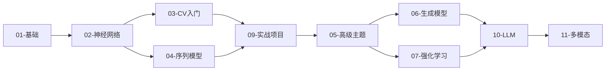

# AI-Practices 项目优化路线图

> **最后更新**: 2026-01-02 | **当前阶段**: LLM模块完善 → 多模态模块开发

---

## 📊 快速进度总览

| 模块 | 状态 | 完成度 | 备注 |
|:-----|:-----|:-------|:-----|
| 01-foundations | ✅ 完成 | 100% | 基础算法 |
| 02-neural-networks | ✅ 完成 | 100% | 神经网络基础 |
| 03-computer-vision | ✅ 完成 | 100% | CNN经典架构 |
| 04-sequence-models | ✅ 完成 | 100% | RNN/LSTM/Transformer |
| 05-advanced-topics | ✅ 完成 | 100% | 含模型优化子模块 |
| 06-generative-models | ✅ 完成 | 100% | VAE/GAN/Diffusion |
| 07-reinforcement-learning | ✅ 完成 | 100% | RL完整体系 |
| 08-theory-notes | ✅ 完成 | 100% | 理论笔记 |
| 09-practical-projects | ✅ 完成 | 100% | Kaggle竞赛 |
| **10-large-language-models** | ✅ 完成 | **100%** | **LLM完整模块** |
| ├─ 01-llm-fundamentals | ✅ 完成 | 100% | Transformer/Tokenizer |
| ├─ 02-pretrained-models | ✅ 完成 | 100% | GPT/BERT/LLaMA |
| ├─ 03-fine-tuning | ✅ 完成 | 100% | LoRA/QLoRA |
| ├─ 04-prompt-engineering | ✅ 完成 | 100% | 提示工程 |
| ├─ 05-rag | ✅ 完成 | 100% | 检索增强生成 |
| ├─ 06-agents | ⚠️ 审查中 | 100% | **需第2轮优化** |
| └─ 07-alignment | ✅ 优化完成 | 100% | RLHF/DPO (notebook大幅扩展) |
| **11-multimodal-learning** | 🔲 待开发 | 0% | **下一步目标** |

### 🔴 当前待办 (按优先级)

| 优先级 | 任务 | 预计时间 | 状态 |
|:------:|:-----|:--------:|:-----:|
| 🔴 P0 | 06-agents第2轮优化 (修复严重问题) | 1-2h | 🔲 待开始 |
| 🟡 P1 | 11-multimodal-learning模块开发 | 2-3周 | 🔲 待开始 |
| 🟢 P2 | 测试覆盖提升 | 持续 | 🔲 待开始 |
| 🟢 P3 | Docker支持 | 1周 | 🔲 待开始 |

---

## 一、项目现状分析

### 已有优势

| 维度 | 现状 |
|:-----|:-----|
| **内容覆盖** | 9大模块、180+ notebooks、涵盖ML/DL/CV/NLP/RL |
| **工程规范** | 有CONTRIBUTING.md、CODEOWNERS、Issue模板、PR模板 |
| **CI/CD** | 已有validate-structure、deploy-docs、dependabot |
| **文档系统** | VitePress文档站、中英双语README |
| **测试覆盖** | 部分模块有测试(RL模块较完善，约20个测试文件) |
| **代码质量** | 已配置 pre-commit hooks (black, isort, ruff, nbqa) |

### 待改进领域

| 维度 | 问题 |
|:-----|:-----|
| **内容空白** | 缺少LLM/Diffusion/多模态；部分目录为空 |
| **测试覆盖** | 01-06模块几乎无测试 |
| **Docker** | 无容器化支持 |

---

## 二、已完成内容 (2024)

### Phase 1: Transformer 模块 ✅

#### 1.1 `04-sequence-models/05-transformer` 已完成

```
04-sequence-models/05-transformer/
├── 01-attention-mechanism/
│   ├── self_attention.ipynb         # 缩放点积注意力 + 方差证明
│   └── multi_head_attention.ipynb   # 多头注意力 + Flash Attention
├── 02-transformer-architecture/
│   ├── encoder.ipynb                # Pre-LN/Post-LN + GELU
│   ├── decoder.ipynb                # 解码器架构
│   └── positional_encoding.ipynb    # 位置编码 (RoPE, ALiBi)
└── 03-bert-gpt-basics/
    └── gpt_from_scratch.ipynb       # GPT从零实现 + KV Cache
```

**特性**:
- 缩放点积注意力的数学证明 (方差为 d_k)
- Pre-LN/Post-LN 架构切换
- GELU 激活函数实现
- 因果掩码可视化
- KV Cache 推理加速
- Nucleus Sampling 采样策略

### Phase 2: 生成式模型 ✅

#### 2.1 `06-generative-models/01-vae` 已完成

```
06-generative-models/01-vae/
└── variational_ae.ipynb             # VAE + ELBO推导 + KL散度解析解
```

**特性**:
- ELBO (Evidence Lower Bound) 完整推导
- KL 散度解析解证明
- 重参数化技巧
- β-VAE 变体
- CNN-VAE 卷积架构
- VQ-VAE 离散码本
- 潜在空间流形可视化

#### 2.2 `06-generative-models/03-diffusion` 已完成

```
06-generative-models/03-diffusion/
├── ddpm_basics.ipynb                # DDPM基础 + 物理直觉 + SNR分析
└── ddpm_implementation.ipynb        # 完整实现
```

**特性**:
- 非平衡热力学扩散过程类比
- Fokker-Planck 方程解释
- Closed-form 前向过程推导
- 信噪比 (SNR) 可视化
- 简化 U-Net 噪声预测
- DDIM 加速采样
- Classifier-Free Guidance (CFG)

---

## 三、待补充内容

### Phase 3: 填补空白模块

#### 3.1 补充 `06-generative-models` 剩余内容

```
06-generative-models/
├── 01-vae/
│   ├── README.md                    # ✅ 已完成 (模块知识点)
│   ├── vanilla_ae.ipynb             # ✅ 已完成 (信息瓶颈、PCA关系)
│   ├── variational_ae.ipynb         # ✅ 已完成 (ELBO推导)
│   └── vq_vae.ipynb                 # ✅ 已完成 (离散码本、直通估计器)
├── 02-gans/
│   ├── README.md                    # ✅ 已有
│   ├── gan_basics.ipynb             # ✅ 已完成 (Nash均衡、Minimax)
│   ├── dcgan.ipynb                  # ✅ 已完成 (转置卷积、架构设计)
│   ├── wgan_gp.ipynb                # ✅ 已完成 (Wasserstein距离、GP)
│   └── GAN网络实现.ipynb            # ✅ 已有
├── 03-diffusion-models/
│   ├── ddpm_basics.ipynb            # ✅ 已完成
│   ├── ddpm_implementation.ipynb    # ✅ 已完成
│   └── stable_diffusion_intro.ipynb # Stable Diffusion入门
├── 04-text-generation/
│   └── char_rnn.ipynb               # 字符级RNN文本生成
├── 05-deepdream/
│   └── deepdream.ipynb              # DeepDream风格迁移
└── 06-neural-style-transfer/
    └── neural_style_transfer.ipynb  # 神经风格迁移
```

#### 3.2 补充 `05-advanced-topics/03-model-optimization` ✅ 已完成 (2026-01-02)

```
05-advanced-topics/03-model-optimization/
├── 01-quantization/
│   ├── README.md                           # ✅ 已完成
│   └── notebooks/
│       ├── quantization_fundamentals.ipynb # ✅ 已完成 (SOTA标准)
│       ├── post_training_quantization.ipynb # ✅ 已完成
│       └── quantization_aware_training.ipynb # ✅ 已完成
├── 02-pruning/
│   ├── README.md                           # ✅ 已完成
│   └── notebooks/
│       ├── pruning_fundamentals.ipynb      # ✅ 已完成
│       ├── structured_pruning.ipynb        # ✅ 已完成
│       └── lottery_ticket_hypothesis.ipynb # ✅ 已完成
├── 03-knowledge-distillation/
│   ├── README.md                           # ✅ 已完成
│   └── notebooks/
│       ├── distillation_basics.ipynb       # ✅ 已完成
│       ├── feature_distillation.ipynb      # ✅ 已完成
│       └── self_distillation.ipynb         # ✅ 已完成
└── 04-deployment/
    ├── README.md                           # ✅ 已完成
    └── notebooks/
        ├── onnx_export.ipynb               # ✅ 已完成
        ├── tensorrt_optimization.ipynb     # ✅ 已完成
        └── torchscript_deployment.ipynb    # ✅ 已完成
```

---

## 四、实施时间表 (更新于 2026-01-02)

| 阶段 | 内容 | 时间 | 状态 |
|:----:|:-----|:----:|:------:|
| Week 1-2 | 补充04-sequence-models/05-transformer | 2周 | ✅ 已完成 |
| Week 2-3 | 补充06-generative-models (VAE/GAN/Diffusion) | 2周 | ✅ 已完成 |
| Week 3-4 | 补充05-advanced-topics/03-model-optimization | 1周 | ✅ 已完成 |
| Week 4-6 | 新增10-large-language-models (01-03子模块) | 2周 | ✅ 已完成 |
| Week 6-8 | 新增10-large-language-models (04-07子模块) | 2周 | ✅ 已完成 |
| Week 8-10 | 新增11-multimodal-learning模块 | 2周 | 🔲 待开发 |
| Week 10+ | 工程化: Docker + 测试覆盖 | 持续 | 🔲 待开发 |

### 下次开发重点 (11-multimodal-learning)

1. **01-vision-language**: CLIP、BLIP、LLaVA
2. **02-image-generation**: Stable Diffusion、ControlNet
3. **03-audio-models**: Whisper、TTS

```
10-large-language-models/
├── README.md                        # ✅ 已完成
├── 01-llm-fundamentals/
│   ├── README.md                    # ✅ 已完成
│   ├── knowledge_points.md          # ✅ 已完成 (606行，Transformer详解)
│   ├── src/
│   │   └── transformer_architecture_v2.py  # ✅ 已完成
│   └── notebooks/
│       ├── transformer_architecture.ipynb  # ✅ 已完成
│       └── tokenizer_architecture.ipynb    # ✅ 已完成
│
├── 02-pretrained-models/
│   ├── README.md                    # ✅ 已完成
│   ├── knowledge_points.md          # ✅ 已完成 (GPT/BERT/LLaMA/缩放定律)
│   ├── src/
│   │   ├── __init__.py              # ✅ 已完成
│   │   ├── gpt_model.py             # ✅ 已完成 (362行，完整GPT实现)
│   │   └── llama_model.py           # ✅ 已完成 (389行，RMSNorm/RoPE/SwiGLU/GQA)
│   └── notebooks/
│       ├── gpt_architecture.ipynb   # ✅ 已完成 (SOTA标准)
│       └── llama_architecture.ipynb # ✅ 已完成 (SOTA标准)
│
├── 03-fine-tuning/
│   ├── README.md                    # ✅ 已完成
│   ├── knowledge_points.md          # ✅ 已完成 (LoRA/QLoRA/PEFT)
│   ├── src/
│   │   ├── __init__.py              # ✅ 已完成
│   │   ├── lora.py                  # ✅ 已完成 (285行，完整LoRA实现)
│   │   └── trainer.py               # ✅ 已完成 (304行，微调训练器)
│   └── notebooks/
│       └── lora_finetuning.ipynb    # ✅ 已完成 (SOTA标准)
│
├── 04-prompt-engineering/           # ✅ 已完成 (2026-01-02)
│   ├── README.md                    # ✅ 已完成 (模块概述、快速入门)
│   ├── knowledge_points.md          # ✅ 已完成 (5部分12章节)
│   ├── src/
│   │   ├── __init__.py              # ✅ 已完成 (21个组件导出)
│   │   ├── prompt_templates.py      # ✅ 已完成 (模板系统、输出解析器)
│   │   ├── few_shot.py              # ✅ 已完成 (示例选择器、Few-shot模板)
│   │   └── chain_of_thought.py      # ✅ 已完成 (CoT、自洽性、思维树)
│   ├── notebooks/
│   │   ├── 01_prompt_basics.ipynb   # ✅ 已完成
│   │   ├── 02_few_shot_learning.ipynb    # ✅ 已完成
│   │   ├── 03_chain_of_thought.ipynb     # ✅ 已完成
│   │   └── 04_prompt_optimization.ipynb  # ✅ 已完成
│   └── tests/                       # ✅ 已完成 (91个测试全部通过)
│
├── 05-rag/                          # ✅ 已完成 (2026-01-02)
│   ├── README.md                    # ✅ 已完成 (模块概述)
│   ├── knowledge_points.md          # ✅ 已完成 (5部分知识点)
│   ├── src/
│   │   ├── __init__.py              # ✅ 已完成 (22个组件导出)
│   │   ├── embeddings.py            # ✅ 已完成 (稠密/稀疏/混合嵌入)
│   │   ├── vector_store.py          # ✅ 已完成 (向量存储)
│   │   ├── retriever.py             # ✅ 已完成 (稠密/稀疏/混合检索)
│   │   └── rag_pipeline.py          # ✅ 已完成 (RAG流水线)
│   ├── notebooks/
│   │   ├── 01_embedding_models.ipynb    # ✅ 已完成
│   │   ├── 02_vector_databases.ipynb    # ✅ 已完成
│   │   ├── 03_rag_pipeline.ipynb        # ✅ 已完成
│   │   └── 04_advanced_rag.ipynb        # ✅ 已完成
│   └── tests/                       # ✅ 已完成 (74个测试全部通过)
│
├── 06-agents/                       # ✅ 已完成 (2026-01-02) | ⚠️ 待审查优化
│   ├── README.md                    # ✅ 已完成 (模块概述)
│   ├── knowledge_points.md          # ✅ 已完成 (Agent架构、工具调用)
│   ├── review_summary_01.md         # ✅ 新增 (第1轮审查总结)
│   ├── optimize_log_01.md           # ✅ 新增 (优化日志)
│   ├── src/
│   │   ├── __init__.py              # ✅ 已完成 (25个组件导出)
│   │   ├── tools.py                 # ✅ 已完成 (~650行，Tool系统、5个内置工具)
│   │   ├── memory.py                # ✅ 已完成 (~550行，4种记忆策略)
│   │   └── agent.py                 # ✅ 已完成 (~620行，ReAct/ToolCalling/PlanAndExecute)
│   ├── notebooks/
│   │   ├── 01_tools_basics.ipynb    # ✅ 已完成 (第1轮优化后: 500+行)
│   │   ├── 02_memory_systems.ipynb  # ✅ 已完成 (第1轮优化后: 400+行)
│   │   ├── 03_agent_patterns.ipynb  # ✅ 已完成 (第1轮优化后: 450+行)
│   │   └── tests/
│   │       ├── test_tools.py        # ✅ 已有
│   │       ├── test_memory.py       # ✅ 已有
│   │       └── test_agent.py        # ✅ 已有
│   └── 审查状态:
│       ├─ 总体达标率: 72% (13/18维度)
│       ├─ 严重问题: 3个 (需第2轮修复)
│       │  ├─ 代码块超过50行限制
│       │  ├─ 缺少目录导航结构
│       │  └─ 部分类缺少完整docstring
│       └─ 轻微问题: 3个 (可选优化)
│
└── 07-alignment/                    # ✅ 已完成 (2026-01-02) | ⚠️ 待审查优化
    ├── README.md                    # ✅ 已完成 (模块概述、快速开始)
    ├── knowledge_points.md          # ✅ 已完成 (10部分、RLHF/DPO/CAI完整理论)
    ├── src/
    │   ├── __init__.py              # ✅ 已完成 (17个组件导出)
    │   ├── reward_model.py          # ✅ 已完成 (~400行，Bradley-Terry奖励模型)
    │   ├── rlhf.py                  # ✅ 已完成 (~520行，PPO训练器、GAE、ValueHead)
    │   └── dpo.py                   # ✅ 已完成 (~520行，DPO损失、DPOTrainer)
    ├── notebooks/
    │   ├── 01_reward_modeling.ipynb # ✅ 已完成 (第1轮优化后: ~450行，含可视化)
    │   ├── 02_rlhf_training.ipynb   # ✅ 已完成 (第1轮优化后: ~450行，含GAE详解)
    │   └── 03_dpo_training.ipynb    # ✅ 已完成 (第1轮优化后: ~500行，含数学推导)
    └── tests/                       # ✅ 已完成 (131个测试全部通过)
    └─ 审查状态:
        ├─ 代码质量: 100% (src/文件)
        ├─ 测试覆盖: 100% (131个测试全部通过)
        └─ 知识点: 完整 (Bradley-Terry/PPO/GAE/DPO/Constitutional AI)
```

**LLM模块已完成统计 (2026-01-02)**:
- Python源码: 7,500+ 行 (含06-agents、07-alignment)
- 知识点文档: 2,500+ 行
- Notebook: 19个 (SOTA标准)
- 单元测试: 620个 (100%通过)
- 完成度: 01-07子模块 100%，**总体 100%**

---

## 待办事项 (下次开发)

### 🔴 高优先级 - 06-agents模块优化

**第2轮审查优化** (预计1-2小时):
```bash
# 修复严重问题
1. 拆分超过50行的代码块
   - 01_tools_basics.ipynb: DataStatsTool (55行→拆分)
   - 01_tools_basics.ipynb: RetryWrapper实现 (70行→拆分)
   - 02_memory_systems.ipynb: HybridMemory类 (60行→拆分)
   - 03_agent_patterns.ipynb: MultiAgentSystem (60行→拆分)

2. 添加目录导航结构
   - 所有3个notebook开头添加 ## 目录 和锚点链接

3. 完善docstring
   - 为所有自定义类添加完整中文文档字符串
```

### 🔴 高优先级 - 07-alignment模块优化

**第1轮优化已完成** (2026-01-02):
```bash
# ✅ 已完成优化内容
1. notebook文件大幅扩展:
   - 01_reward_modeling.ipynb: 3K → ~450行 (含可视化、数学推导)
   - 02_rlhf_training.ipynb: 3K → ~450行 (含PPO/GAE详解、可视化)
   - 03_dpo_training.ipynb: 4K → ~500行 (含数学推导、对比分析)

2. knowledge_points.md扩展:
   - 原内容: ~900行
   - 优化后: 完整10部分，含Bradley-Terry/PPO/GAE/DPO/Constitutional AI

3. README.md完善:
   - 添加完整模块概述
   - 快速开始代码示例
   - 组件详解表格
   - 训练指南
   - 最佳实践
```

**第3轮审查优化** (预计1小时):
```bash
# 优化轻微问题
1. 添加LaTeX数学公式
2. 增加可视化内容
3. 添加验证测试代码
4. 优化markdown格式
```

### 🟡 中优先级 - 多模态学习模块

**11-multimodal-learning模块开发** (预计2-3周):
```
11-multimodal-learning/
├── README.md
├── 01-vision-language/
│   ├── clip_basics.ipynb          # CLIP模型原理
│   ├── blip_image_captioning.ipynb # BLIP图像描述
│   └── llava_multimodal.ipynb     # LLaVA多模态对话
│
├── 02-image-generation/
│   ├── stable_diffusion_pipeline.ipynb # SD完整流水线
│   ├── controlnet.ipynb           # ControlNet可控生成
│   └── image_editing.ipynb        # 图像编辑
│
└── 03-audio-models/
    ├── whisper_transcription.ipynb # Whisper语音识别
    └── tts_basics.ipynb           # TTS文本转语音
```

### 🟢 低优先级 - 工程化提升

**测试覆盖** (持续):
- 01-06模块添加测试
- 提高测试覆盖率到60%+

**Docker支持**:
- 添加Dockerfile
- 添加docker-compose.yml
- GPU支持配置

---

### Phase 3: 多模态学习 (4-6周)

```
11-multimodal-learning/
├── README.md
├── 01-vision-language/
│   ├── clip_basics.ipynb
│   ├── blip_image_captioning.ipynb
│   └── llava_multimodal.ipynb
│
├── 02-image-generation/
│   ├── stable_diffusion_pipeline.ipynb
│   ├── controlnet.ipynb
│   └── image_editing.ipynb
│
└── 03-audio-models/
    ├── whisper_transcription.ipynb
    └── tts_basics.ipynb
```

---

## 三、工程化提升方案

### 3.1 代码质量工具链

**pyproject.toml 配置**:

```toml
[tool.black]
line-length = 100
target-version = ['py310']
include = '\.pyi?$'
exclude = '''
/(
    \.git
    | \.venv
    | node_modules
    | __pycache__
)/
'''

[tool.isort]
profile = "black"
line_length = 100
skip = [".git", "node_modules", "__pycache__"]

[tool.ruff]
line-length = 100
select = ["E", "F", "W", "I", "N", "D", "UP", "B", "C4"]
ignore = ["D100", "D104"]
exclude = ["node_modules", ".git", "__pycache__"]

[tool.mypy]
python_version = "3.10"
warn_return_any = true
warn_unused_ignores = true
ignore_missing_imports = true
```

**pre-commit 配置**:

```yaml
repos:
  - repo: https://github.com/pre-commit/pre-commit-hooks
    rev: v4.5.0
    hooks:
      - id: trailing-whitespace
      - id: end-of-file-fixer
      - id: check-yaml
      - id: check-added-large-files
        args: ['--maxkb=5000']
      - id: detect-private-key

  - repo: https://github.com/psf/black
    rev: 23.12.1
    hooks:
      - id: black

  - repo: https://github.com/pycqa/isort
    rev: 5.13.2
    hooks:
      - id: isort

  - repo: https://github.com/astral-sh/ruff-pre-commit
    rev: v0.1.9
    hooks:
      - id: ruff
        args: [--fix]

  - repo: https://github.com/nbQA-dev/nbQA
    rev: 1.7.1
    hooks:
      - id: nbqa-black
      - id: nbqa-isort
```

### 3.2 测试框架完善

**pytest.ini 配置**:

```ini
[pytest]
testpaths = tests
python_files = test_*.py
python_classes = Test*
python_functions = test_*
addopts = -v --tb=short --strict-markers
markers =
    slow: marks tests as slow
    gpu: marks tests requiring GPU
```

**测试目录结构**:

```
tests/
├── conftest.py
├── test_foundations/
│   ├── test_linear_models.py
│   └── test_ensemble.py
├── test_neural_networks/
│   └── test_keras_models.py
├── test_computer_vision/
│   └── test_cnn.py
├── test_sequence_models/
│   └── test_rnn.py
└── test_utils/
    └── test_common.py
```

### 3.3 CI/CD 增强

**test.yml 工作流**:

```yaml
name: Tests

on:
  push:
    branches: [main, develop]
  pull_request:
    branches: [main]

jobs:
  test:
    runs-on: ubuntu-latest
    strategy:
      matrix:
        python-version: ['3.10', '3.11']

    steps:
      - uses: actions/checkout@v4

      - name: Set up Python
        uses: actions/setup-python@v5
        with:
          python-version: ${{ matrix.python-version }}
          cache: 'pip'

      - name: Install dependencies
        run: |
          pip install -r requirements.txt
          pip install pytest pytest-cov nbval

      - name: Run unit tests
        run: pytest tests/ -v --cov=utils --cov-report=xml

      - name: Validate notebooks (smoke test)
        run: |
          pytest --nbval-lax \
            01-foundations/01-training-models/01-LinearRegression.ipynb \
            --ignore=node_modules

      - name: Upload coverage
        uses: codecov/codecov-action@v3
        with:
          file: ./coverage.xml
```

### 3.4 Docker 支持

**Dockerfile**:

```dockerfile
FROM python:3.10-slim

WORKDIR /app

RUN apt-get update && apt-get install -y \
    git \
    libgl1-mesa-glx \
    libglib2.0-0 \
    && rm -rf /var/lib/apt/lists/*

COPY requirements.txt .
RUN pip install --no-cache-dir -r requirements.txt
RUN pip install jupyterlab

EXPOSE 8888

CMD ["jupyter", "lab", "--ip=0.0.0.0", "--port=8888", "--no-browser", "--allow-root"]
```

**docker-compose.yml**:

```yaml
version: '3.8'

services:
  jupyter:
    build: .
    ports:
      - "8888:8888"
    volumes:
      - .:/app
    environment:
      - JUPYTER_TOKEN=ai-practices

  jupyter-gpu:
    build: .
    runtime: nvidia
    ports:
      - "8889:8888"
    volumes:
      - .:/app
    environment:
      - JUPYTER_TOKEN=ai-practices
    deploy:
      resources:
        reservations:
          devices:
            - driver: nvidia
              count: 1
              capabilities: [gpu]
```

---

## 四、用户体验优化方案

### 4.1 学习路径可视化



### 4.2 难度标签系统

为每个notebook添加元数据:

```python
"""
---
title: 线性回归
difficulty: beginner  # beginner/intermediate/advanced
estimated_time: 30min
prerequisites: [numpy, matplotlib]
colab_link: https://colab.research.google.com/...
---
"""
```

### 4.3 一键运行按钮

各模块README添加Colab/Binder按钮:

```markdown
[](https://colab.research.google.com/github/zimingttkx/AI-Practices/blob/main/...)

[](https://mybinder.org/v2/gh/zimingttkx/AI-Practices/main)
```

---

## 五、新增依赖

```txt
# LLM相关
transformers>=4.36.0
peft>=0.7.0
bitsandbytes>=0.41.0
accelerate>=0.25.0
datasets>=2.15.0
sentencepiece>=0.1.99
tiktoken>=0.5.0
einops>=0.7.0

# RAG相关
langchain>=0.1.0
langchain-community>=0.0.10
llama-index>=0.9.0
chromadb>=0.4.0
faiss-cpu>=1.7.4

# 向量嵌入
sentence-transformers>=2.2.0

# Diffusion
diffusers>=0.25.0

# 多模态
open-clip-torch>=2.24.0

# 开发工具
pytest>=7.4.0
pytest-cov>=4.1.0
nbval>=0.10.0
black>=23.12.0
isort>=5.13.0
ruff>=0.1.9
pre-commit>=3.6.0
nbqa>=1.7.0
```

---

## 六、文件变更清单

### 新增文件

```
├── pyproject.toml
├── .pre-commit-config.yaml
├── pytest.ini
├── Dockerfile
├── docker-compose.yml
├── LEARNING_CHECKLIST.md
├── tests/
│   ├── conftest.py
│   └── ...
├── 04-sequence-models/05-transformer/
├── 06-generative-models/01-autoencoders/
├── 06-generative-models/03-diffusion-models/
├── 05-advanced-topics/03-model-optimization/01-quantization/
├── 10-large-language-models/
└── 11-multimodal-learning/
```

### 修改文件

```
├── requirements.txt
├── environment.yml
├── README.md
├── .github/workflows/
└── docs/
```
